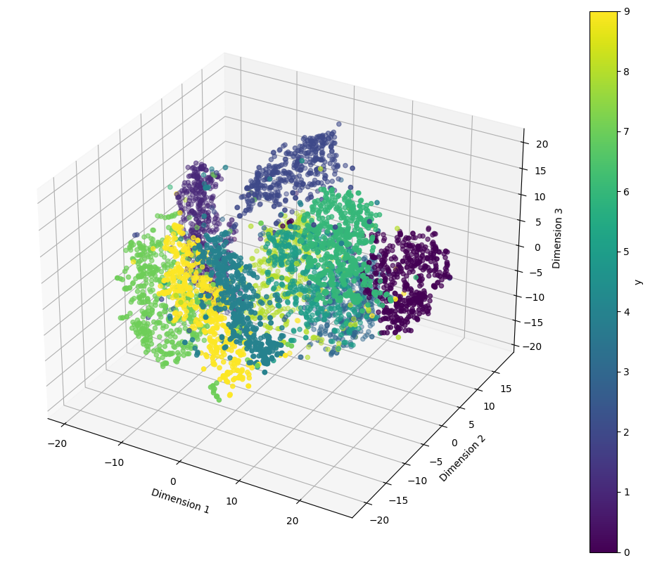
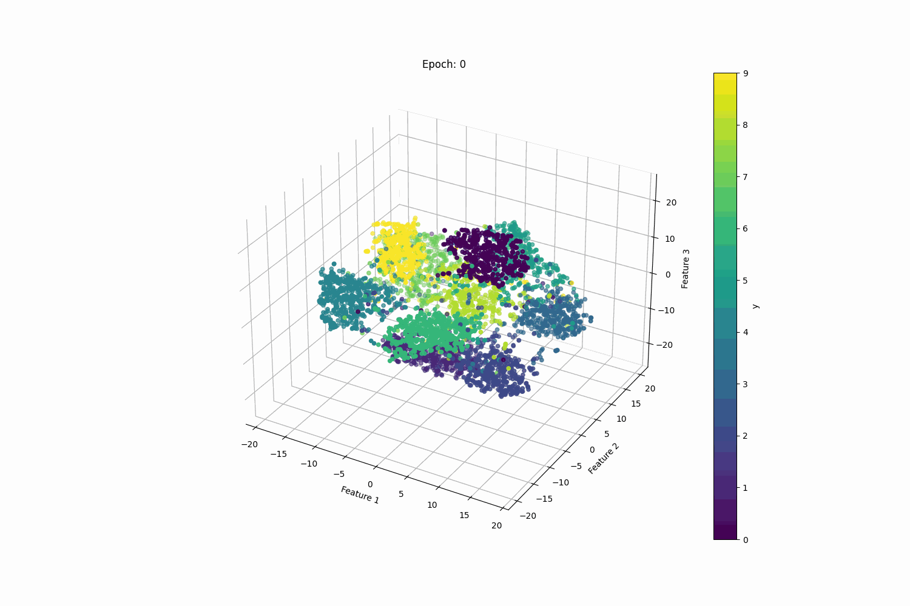
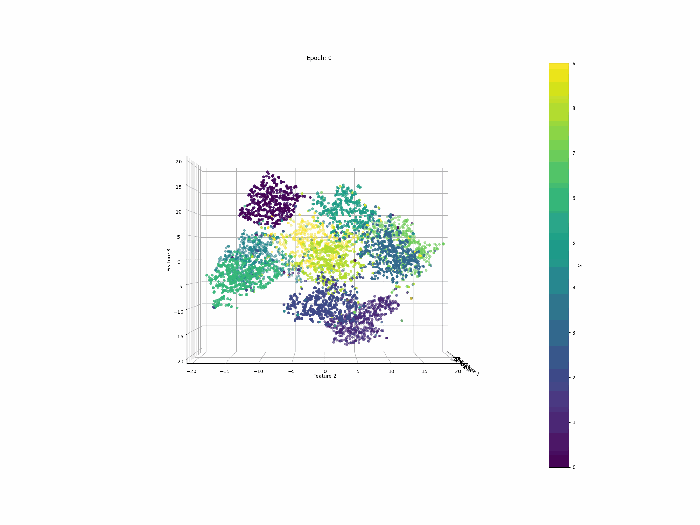
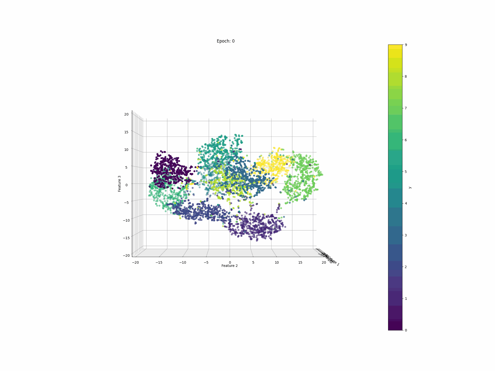
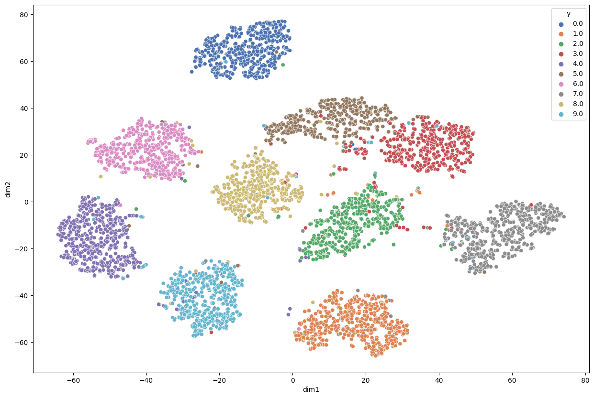

# Deep learning model building meaningful representation space in each layer
### 784D data projected into 3D space - before learning

### Layer 1 learning better representation space in each epoch - 30D to 3D

### Layer 2 learning better representaton space in each epoch - 20D to 3D

### Layer 3 learning better representaton space in each epoch - 10D to 3D

### Layer 3s learned space - 10D to 2D

